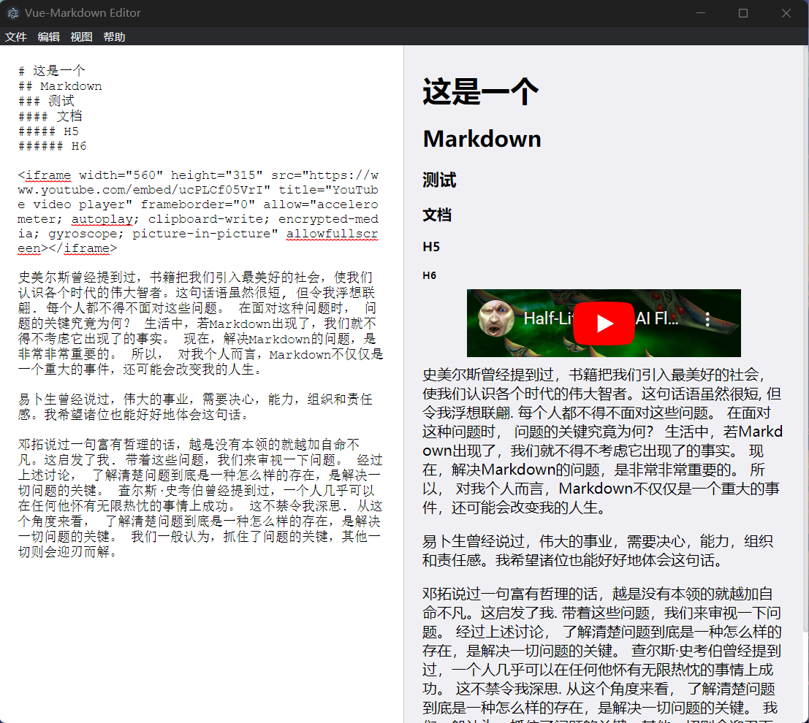

# Vue-Markdown Editor

个人的一个 Vue + Electron 的练手项目。

## 项目预览



## ⬇下载

您可以直接到[Releases · Direct5dom/vue-markdown](https://github.com/Direct5dom/vue-markdown/releases)下载已经打包好的软件。

## 🛠️构建

想要构建此项目，您需要：

```sh
git clone https://github.com/Direct5dom/vue-markdown
cd vue-markdown
yarn
# 您可能还需要
## 安装electron至vite应用
yarn add --dev electron
## 安装concurrently和wait-on
yarn add -D concurrently wait-on
```

运行

```sh
yarn electron:serve
```

## 📦︎打包

您可能需要：

```sh
## 安装cross-env和electron-builder
yarn add -D cross-env electron-builder
```

想要打包此项目，您需要在项目根目录运行：

```sh
yarn electron:build
```

## ⚖️License

[MIT license](./LICENSE)